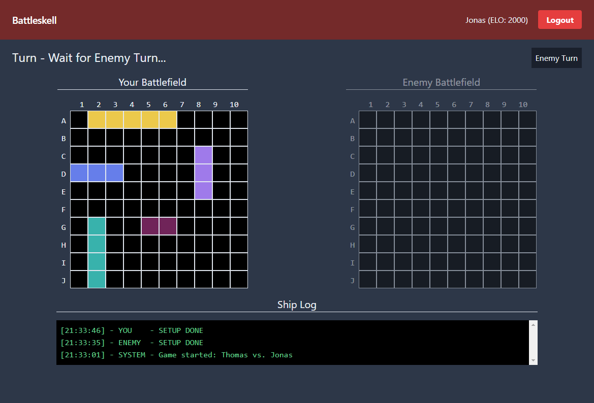
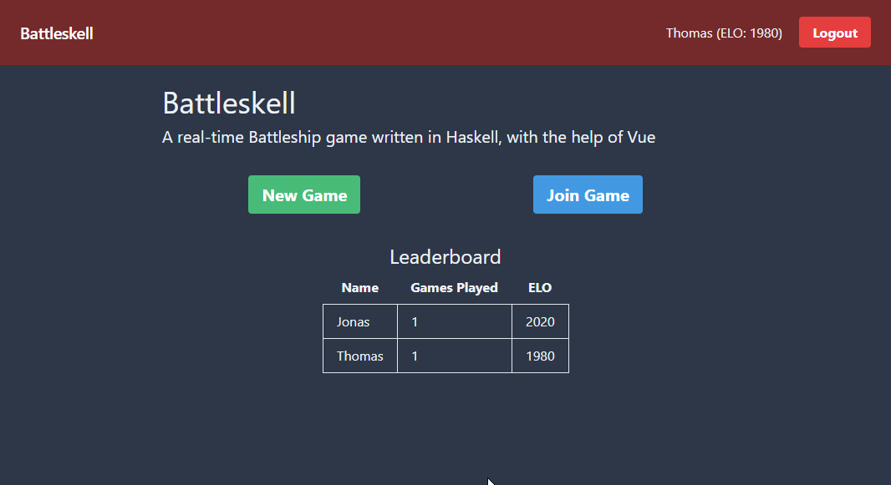
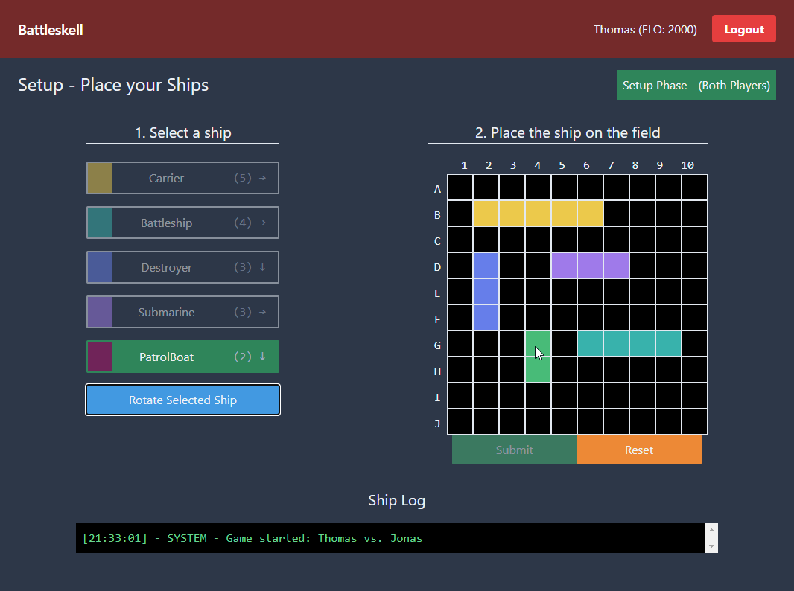
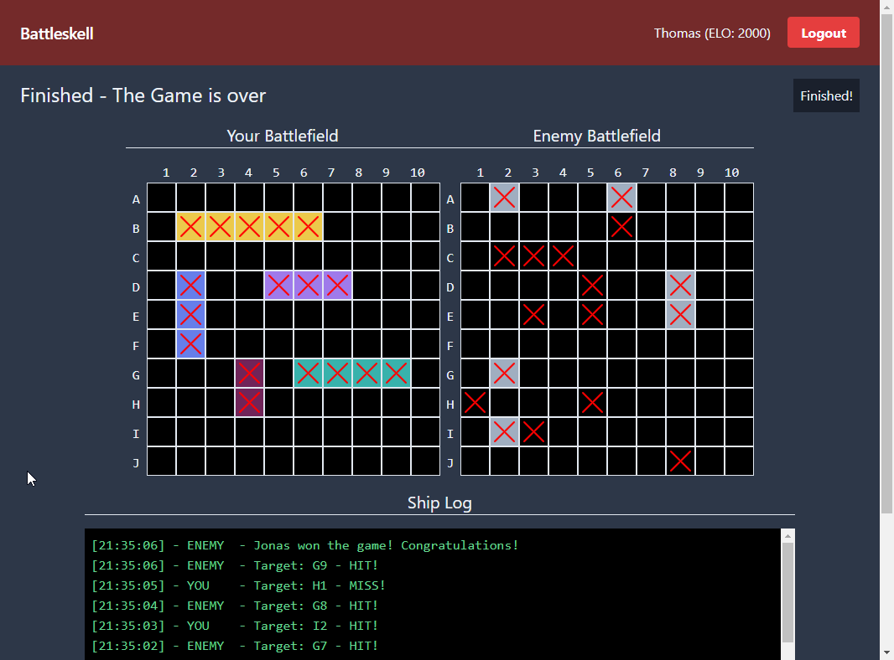

# Battleskell

**[DEMO](https://battleskell.dellinger.dev/)**

> An online real-time battleship game written in Haskell, with a bit of VueJS for the dynamic frontend part. It was written for the advanced functional programming module @LMU Munich, in the summer term 2020.









## Features

- User System (No E-Mail support)
- Realtime Game Logic
- Realtime Lobby Matchmaking
- Leaderboard based on Elo & Game Count
- Persistent via PostgreSQL
- VueJS Frontend (JS Modules)
- Mobile friendly via TailwindCSS grid

## Running It

### Requirements

- Stack
- Docker or local PostgreSQL
- `libpq-dev` or similar for compiling the postgresql driver

### Build & Run

```sh
# run a local postgresql via docker, you can skip this if you have system wide postgresql installation
# note, on container stop the database is not persisted
docker run -d --rm --name postgres -p 5432:5432 -e POSTGRES_PASSWORD=postgres postgres:12-alpine
# create the database battleskell
docker exec postgres createdb -U postgres battleskell

stack build
# This will also run migrations
stack run
```

## Architecture

At its heart, the project is a yesod application with postgres as backend. Some parts of the application, like the login, registration and home are statically rendered by yesod using the hamlet templating engine. Other highly dynamic parts, like the lobby and ingame parts are rendered on the client using the frontend framework VueJS. These dynamic pages first load their state using XHR requests, to which yesod answers with JSON payloads. Then, a websocket connection takes care of keeping the client up-to-date. E.g in the lobby screen, the websocket connection adds new and removes old lobbies automically from the list. Thus, the user has realtime experience without having to refresh the page.

### Yesod Backend

The yesod backend uses different libraries to support the user-system, websockets and more complicated SQL queries. To list a few:

- **yesod-auth-hashdb**:
  > It provides authentication using hashed passwords stored in a database, and works best in situations where an administrator is involved in setting up a user with an initial password.
- **yesod-websockets**:
  > Websockets support for yesod, using normal handler functions as entry point. Allows to send and receive in a bidirectional manner with clients.
- **esqueleto**:
  > Advanced SQL Library, allowing fully typed JOIN operations.
- **lens**
  > This package comes "Batteries Included" with many useful lenses for the types commonly used from the Haskell Platform, and with tools for automatically generating lenses and isomorphisms for user-supplied data types.
  >
  > Used to filter and updated deeply nested data structures easily

Some of the utilized haskell principles:

- Monads
- Class and Instances
- Lenses
- Parallel & Concurrent
- Records
- Higher-order functions
- Vectors

### VueJS Frontend

The VueJS frontend was written via JS modules. This rather modern technique allowed to split frontend logic across seperate files, while not depending on a global `window` namespace. The VueJS templates were written in hamlet files via `text/x-template` scripts, which was quite a nice combiniation due to hamlets concise syntax:

```html
<script type="text/x-template">
  <div .w-full>
    {{ message }}
```
